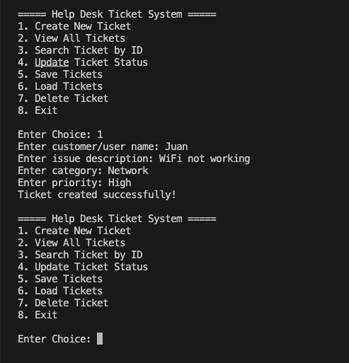
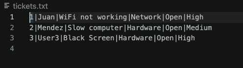

# Help Desk Ticket System

A C++ console-based help desk ticket management system that allows users to create, view, search, update, delete, save, and load IT support tickets.

## Project Overview

This project simulates a basic IT help desk ticket system. Users can create support tickets for technical issues, update ticket statuses, search for specific tickets by ID, delete tickets, and save/load ticket data using a text file.

The project was built to practice C++ programming concepts while creating a realistic IT-related application.

## Features

* Create new support tickets
* View all existing tickets
* Search for a ticket by ID
* Update ticket status
* Delete tickets
* Save tickets to a text file
* Load tickets from a text file
* Automatically generate ticket IDs
* Prevent duplicate ticket IDs after deletion

## Screenshots




## Technologies Used

* C++
* Vectors
* Classes and Objects
* Functions
* File Input/Output
* Stringstream
* Console-based menu system

## What I Learned

Through this project, I practiced:

* Using classes to organize data
* Managing a list of objects with vectors
* Reading and writing data to files
* Searching and updating records
* Deleting elements from a vector
* Creating helper functions for cleaner code
* Building a menu-driven console application

## How It Works

Each ticket stores the following information:

* Ticket ID
* User name
* Issue description
* Category
* Status
* Priority

Ticket data is saved to a text file using a delimiter-based format:

```text
id|name|issue|category|status|priority
```

When the program loads tickets, it reads each line from the file, separates the values, and rebuilds the ticket list.

## Example Ticket

```text
Ticket ID: 1
Name: Juan
Issue: Wi-Fi not working
Category: Network
Status: Open
Priority: High
```

## How to Run

1. Clone or download this repository.
2. Open the project in Visual Studio, VS Code, or another C++ IDE.
3. Compile the program.
4. Run the executable.
5. Use the menu options to manage tickets.

## Future Improvements

* Add ticket sorting by priority or status
* Add due dates for tickets
* Add user login support
* Add a graphical user interface
* Create a web version using HTML, CSS, and JavaScript
* Store tickets in a database instead of a text file